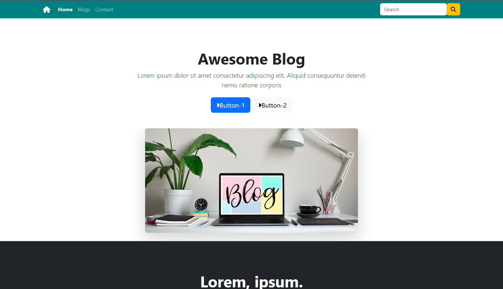
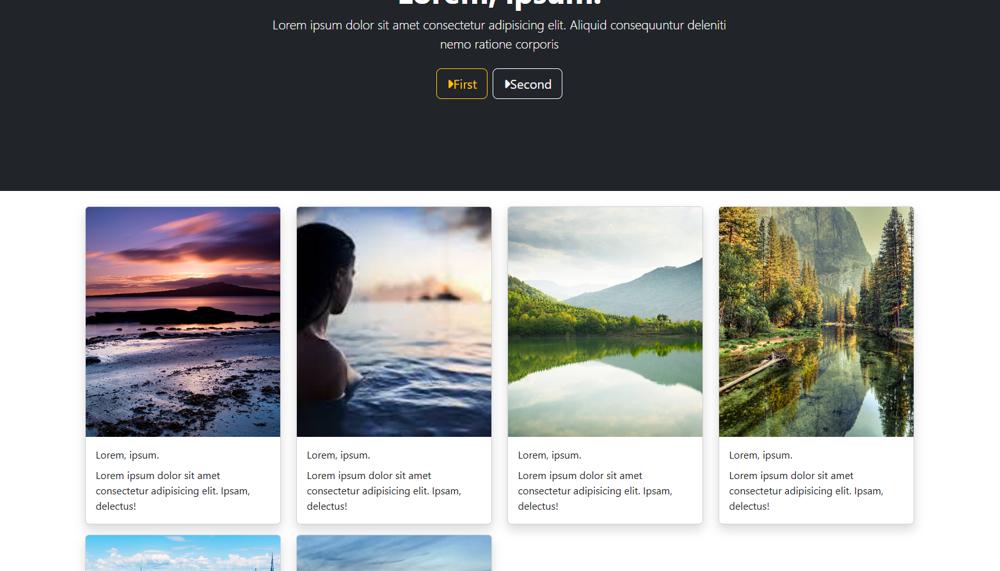
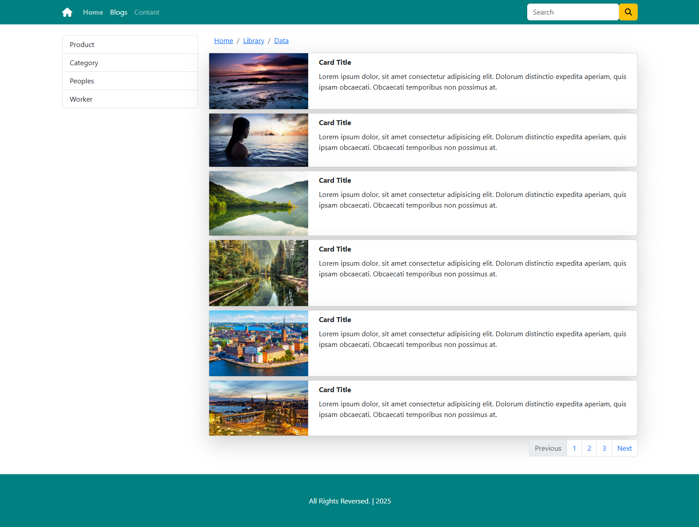
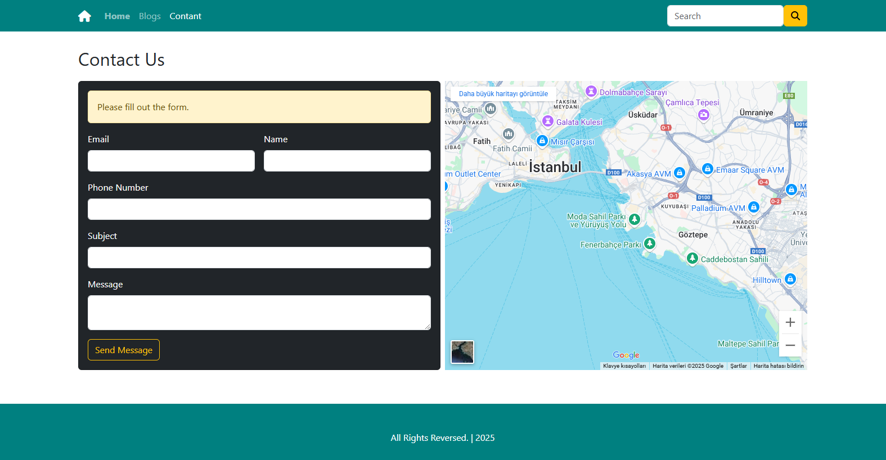
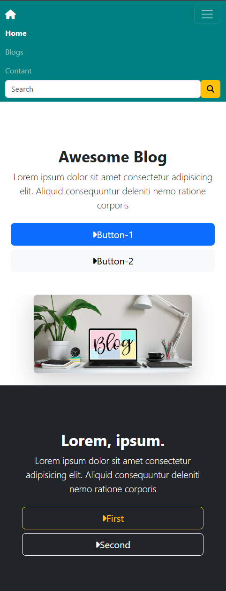

#**FRONT-END PROJECT EXAMPLES AND DESCRIPTIONS(WEB DESIGNS)**

##**1-Project : E-commerce-front-end examples (Web Page Designs)**
    ###In this section, e-commerce web page front-end design examples are available.

###**1-Project : E-commerce-front-end examples**

###1.1- FILTER PORJECT

    ###There is an example of a filter section on e-commerce sites in this section. I have been designing with bootstrap and css. In this section, I made a sample design using accordion-collapse and card-collapse.

    ###**Web Development Technologies:** HTML,CSS,BOOTSTRAP

###1.2- CARD PROJECT

    ###In this section, I created the information and images of the products using the bootstrap card structure. In this section, I have transferred the information sections transmitted by the backend to the front side.

    ###**Web Development Technologies:** HTML,CSS,BOOTSTRAP

###1.3-COMMENT PROJECT

    ###I have created the comment page in this section. I created the evaluation section representing the users' images, names, the total number of comments, the proportions of the stars according to the comments made.

    ###**Web Development Technologies:** HTML,CSS,BOOTSTRAP

###1.3-BLOG PROJECT

    ### This project consists of 3 parts.

    ### 1.Section home page

        ####I designed the sections that provide general information in the first part and information about each product or topic as cards. I ensured device-appropriate display with responsive design.

    ### 2.Section blog page,

        ####In the blog section, I visualized the products. In this section, I designed the filter application section according to the product type and using pagination, where I determined how many products will be on each page.

    ### 3.Section contact page,

        ####In the communication section, I have added the google map section indicating the location of the business. I made the necessary contact page design by creating a form and taking the information of people who want to communicate.

    ###**Web Development Technologies:** HTML,CSS,BOOTSTRAP