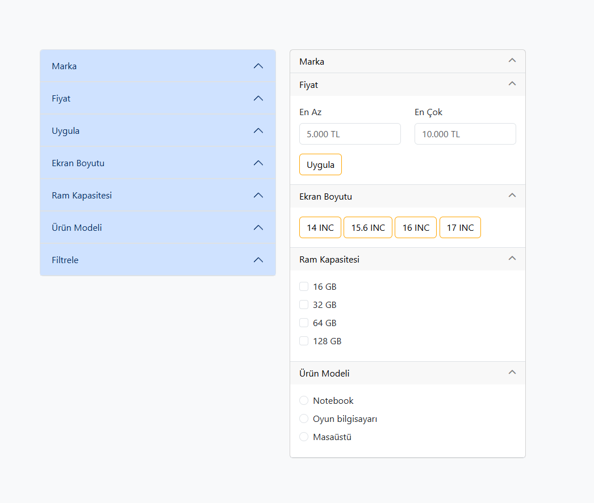
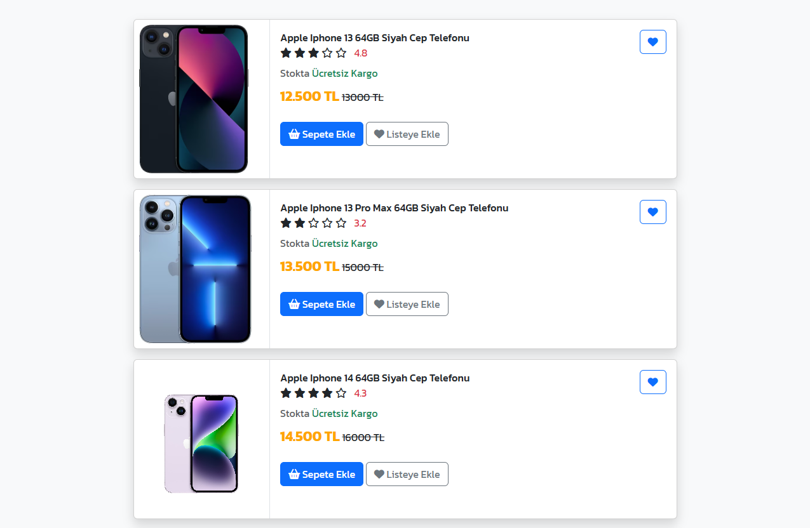
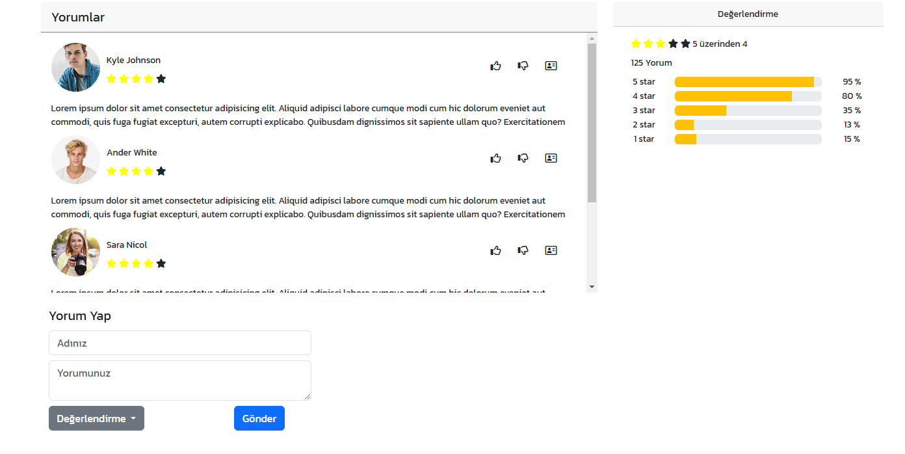

FRONT-END PROJECT EXAMPLES AND DESCRIPTIONS(WEB DESIGNS)

//==============================================================

1-Project : E-commerce-front-end examples (Web Page Designs)
    In this section, e-commerce web page front-end design examples are available.

//==============================================================
1-Project : E-commerce-front-end examples

1.1- Filter section
    There is an example of a filter section on e-commerce sites in this section. I have been designing with bootstrap and css. In this section, I made a sample design using accordion-collapse and card-collapse.
    Web Development Technologies: HTML,CSS,BOOTSTRAP

1.2- Card section
    In this section, I created the information and images of the products using the bootstrap card structure. In this section, I have transferred the information sections transmitted by the backend to the front side.
    Web Development Technologies: HTML,CSS,BOOTSTRAP

1.3-Comment section
    I have created the comment page in this section. I created the evaluation section representing the users' images, names, the total number of comments, the proportions of the stars according to the comments made.
    Web Development Technologies: HTML,CSS,BOOTSTRAP
//==============================================================